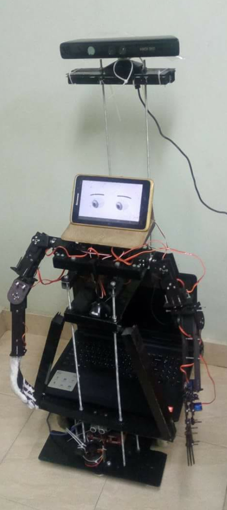

# Humaniod Robot Graduation Project

A **Humanoid Robot** Built From Scratch.

Main Tasks:

- Robot Control and Teleoperation using Depth Camera and Image Processing libraries.
- Robot Automation using ROS and Google Assistant.
- Implementing Robot Environment Awareness using Face, Object and Text Recognition Open Source Libraries.
- Automatic Environment Navigation using Senors and Actuators.

---

### Used Tools and Technologies

| Tool/Technology                                                                         | About                                       | Used For                       |
| --------------------------------------------------------------------------------------- | ------------------------------------------- | ------------------------------ |
| [Linux](https://www.linux.org/)                                                         | Open-source Operating System                | Robot Main OS                  |
| [ROS (Robot Operating System)](https://www.ros.org/)                                    | Open-source Robotics Framework              | Robot Main Control Software    |
| [Raspberry Pi](https://www.raspberrypi.org/)                                            | Small Single-board Computer                 | Robot Body Control             |
| [YOLO](https://pjreddie.com/darknet/yolo/)                                              | Open-source Object Detection Library        | Real-Time Object Detection     |
| [Face Recognition](https://github.com/ageitgey/face_recognition)                        | Open-source Face Recognition Library        | Real-Time Face Recognition     |
| [OpenCV](https://opencv.org/)                                                           | Real-time Optimized Computer Vision Library | Human Skeleton tracking        |
| [kinect camera](https://en.wikipedia.org/wiki/Kinect)                                   | Motion Sensing Depth Camera                 | Robot Teleoperation            |
| [VR Box](https://www.amazon.eg/-/en/VR-Box-Cardboard-Virtual-Smartphones/dp/B08Y8YXZ5D) | VR Headset                                  | Head Pose Tracking             |
| [Bash Scripting](https://www.gnu.org/software/bash/)                                    | Scripting Language                          | Robot Automation               |
| [Python](https://www.python.org/)                                                       | Programming Language                        | Robot Control                  |
| [OpenSSH](https://www.openssh.com/)                                                     | Robot Nodes Communication                   | Robot Nodes Communication      |
| [Firebase](https://firebase.google.com/)                                                | Hosting Services Platform                   | Real-Time Remote Robot Control |
| [Android](https://www.android.com/)                                                     | Mobile Operating System                     | VR Android Applicaion          |
| [Google Assistant](https://assistant.google.com/)                                       | Virtual Assistant Software Application      | Voice Control                  |
| [Arduino](https://www.arduino.cc/)                                                      | Open Source Single-board Microcontroller    | Robot Base Control             |

---

## Hello World!

## 

## Contributors ✨

<!-- ALL-CONTRIBUTORS-LIST:START - Do not remove or modify this section -->
<!-- prettier-ignore-start -->
<!-- markdownlint-disable -->
<table>
  <tr>
    <td align="center"><a href="https://github.com/ahmedfarag9"> <b>Ahmed Farag</b></a>  </td>
    <td align="center"><a href="https://github.com/FadyFouad"> <b>Fady Fouad</b></a>  </td>
  </tr>
</table>

<!-- markdownlint-enable -->
<!-- prettier-ignore-end -->

<!-- ALL-CONTRIBUTORS-LIST:END -->
